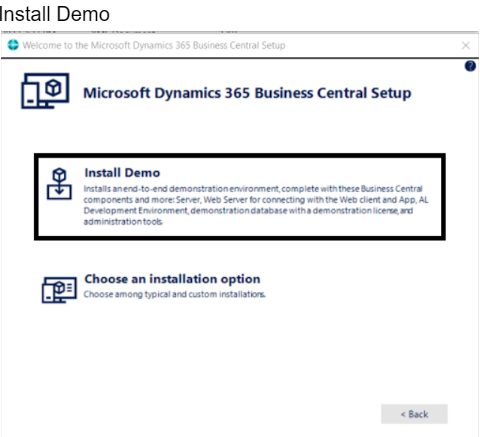
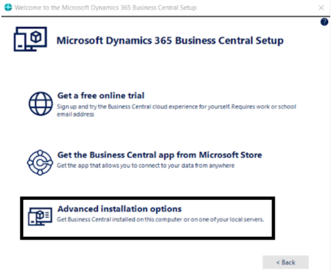
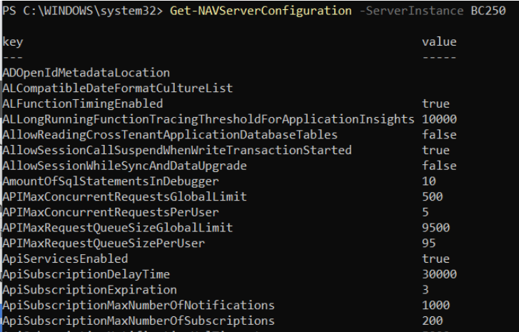
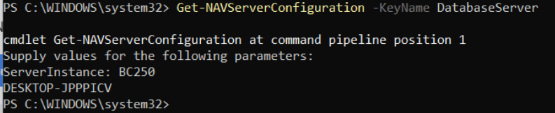
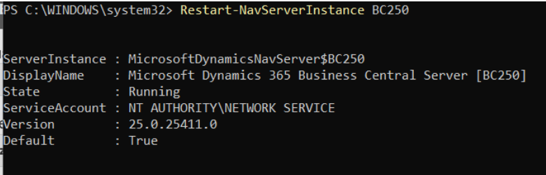
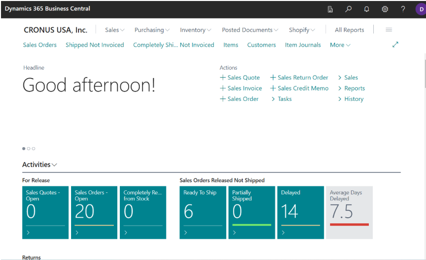

# Microsoft Dynamics 365 Business Central (On-Premises) Setup Guide

## Table of Contents
1. [Introduction](#introduction)  
2. [Installation and Setup](#installation-and-setup)  
    - [Downloading and Installing Business Central](#downloading-and-installing-business-central)  
    - [Advanced Installation Options](#advanced-installation-options)  
3. [Configuring Business Central Using PowerShell](#configuring-business-central-using-powershell)  
    - [Viewing Configuration Settings](#viewing-configuration-settings)  
    - [Updating Configuration Settings](#updating-configuration-settings)  
4. [Creating New Companies and Users](#creating-new-companies-and-users)  
    - [Creating a New Company](#creating-a-new-company)  
    - [Creating a New User](#creating-a-new-user)  
5. [Enabling and Disabling Services](#enabling-and-disabling-services)  
    - [Enabling SOAP Services](#enabling-soap-services)  
    - [Accessing the Dashboard](#accessing-the-dashboard)  
6. [Changes in Business Central Server Administration Tool](#changes-in-business-central-server-administration-tool)  
    - [Obsolescence of the Business Central Server Administration Tool](#obsolescence-of-the-business-central-server-administration-tool)  
    - [Using PowerShell Cmdlets for Administration](#using-powershell-cmdlets-for-administration)

---

## Introduction
Microsoft Dynamics 365 Business Central, formerly known as Dynamics NAV, is an Enterprise Resource Planning (ERP) solution designed for small and mid-sized businesses. Business Central helps organizations manage their processes by automating and streamlining business operations.

This guide explains how to set up Business Central on your local machine (on-premises), covering installation, configuration, and key tasks required to get the system operational.

---

## Installation and Setup

### Downloading and Installing Business Central
To install Business Central on-premises, follow these steps:

1. Visit the official Microsoft download page: [Microsoft Dynamics 365 Business Central Download](https://www.microsoft.com/en-us/download/details.aspx?id=106256).
2. Download the US variant (ZIP file).
3. Extract the ZIP file and ensure you grant administrator rights to all current folders.
4. After extracting, run the setup application (`setup.exe`) located in the extracted folder.

### Advanced Installation Options


When running the installer, you have the following advanced options:

- **Install Demo**: Installs a demo instance of Business Central.
- **Custom Install**: Allows you to configure the installation settings as per your requirements.



For the purpose of this demo, we will be going with "Install Demo".

---

## Configuring Business Central Using PowerShell

### Viewing Configuration Settings
Once the installation is complete, further configuration is done through Windows PowerShell. Open PowerShell as an administrator and import the Business Central module using the following command:

```bash
Import-Module -Name "C:\Program Files\Microsoft Dynamics 365 Business Central\250\Service\navadmintool.ps1"
```

To view the configuration settings for a specific instance, use the following command:

```bash
Get-NAVServerConfiguration BC250
```


To get a specific configuration key, use:

```bash
Get-NAVServerConfiguration -KeyName <Key>
```


### Updating Configuration Settings
To update a specific configuration setting, use the `Set-NAVServerConfiguration` command:

```bash
Set-NAVServerConfiguration BC250 -KeyName <DesiredKey> -KeyValue <DesiredVal>
```

After making changes, restart the Business Central server instance for the changes to take effect:

```bash
Restart-NAVServerInstance BC250
```



---

## Creating New Companies and Users

### Creating a New Company
To create a new company in Business Central, use the following command:

```bash
New-NAVCompany BC250 -CompanyName "NewCompanyName"
```

### Creating a New User
To create a new user with a secure password, run the following commands:

```bash
$securePassword = ConvertTo-SecureString "Password1" -AsPlainText -Force
New-NAVServerUser BC250 -UserName "User1" -Password $securePassword
```

---

## Enabling and Disabling Services

### Enabling SOAP Services
To enable SOAP services, run:

```bash
Set-NAVServerInstance BC250 -SoapServicesEnabled true
```

### Accessing the Dashboard
After completing the setup, you can access your Business Central dashboard using the following URL:

```
http://localhost:8080/BC250/
```



---

## Changes in Business Central Server Administration Tool

### Obsolescence of the Business Central Server Administration Tool
The **Business Central Server Administration tool** was a Microsoft Management Console (MMC) snap-in used for creating and managing Business Central Server instances. Previously, you could launch it by selecting *Business Central Administration* from the Start menu or by running MMC and adding the Business Central snap-in manually.

Starting with **Business Central 2022 Release Wave 2 (version 21)**, the Business Central Server Administration tool is no longer available. Instead, Microsoft recommends using the **Business Central Administration Shell** for all server management tasks.

### Using PowerShell Cmdlets for Administration
Since the Business Central Server Administration tool is obsolete, the following PowerShell cmdlets are used for managing Business Central deployments:

- **Administration Cmdlets for Business Central**: Manage Business Central Server instances, databases, and configurations.
- **Administration Cmdlets for Business Central Web Server Instances**: Manage web server instances.
- **Development Cmdlets for Business Central**: Support development tasks such as managing extensions.

For a complete list of new and modified cmdlets since version 21, refer to the *Cmdlet Changes in Business Central* resource on Microsoft Learn.
s